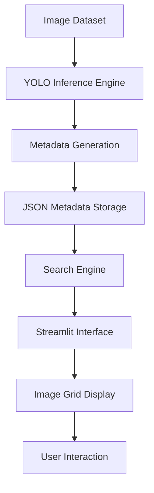

---

# YOLO-based Visual Object Search System

## Table of Contents

- [Overview](#overview)
- [Vision](#vision)
- [Project Structure](#project-structure)
- [Architecture](#architecture)
- [System Architecture Diagram](#system-architecture-diagram)
- [Application Control Flow](#application-control-flow)
- [Pain Points and Solutions](#pain-points-and-solutions)
- [Tech Stack](#tech-stack)
- [System Design Considerations](#system-design-considerations)
- [Installation](#installation)
- [Running the Application](#running-the-application)
- [Features](#features)
- [Future Improvements](#future-improvements)
- [License](#license)

---

# Overview

This project implements a **computer vision–powered image search system** that uses **YOLO object detection models** to analyze images and generate structured metadata for visual search.

The system processes image collections, extracts detected objects and bounding boxes, and enables users to **search images using detected classes and count thresholds**.

The application includes:

- **YOLO-based object detection inference pipeline**
- **Metadata generation for image indexing**
- **Interactive search interface**
- **Bounding box visualization**
- **Streamlit-based UI for image exploration**
- **Flexible filtering using logical search conditions**

[⬆ Back to Top](#table-of-contents)

---

# Vision

The goal of this project is to build an **interactive computer vision system** that enables users to explore image datasets using object detection results.

Traditional image search systems rely on manual tagging or filename metadata. This system instead uses **automatic object detection to create searchable metadata**, allowing users to retrieve images based on visual content.

The vision of this system is to:

- Enable **content-based image retrieval**
- Provide **interactive exploration of object detection results**
- Support **multiple detection model variants**
- Improve **interpretability of detection outputs**
- Demonstrate **modular design for computer vision pipelines**

[⬆ Back to Top](#table-of-contents)

---

# Project Structure

```
Yolo_image_search
├── processed
│   └── Image_search
│       ├── metadata.json
│       ├── metadata_yolo11m.json
│       ├── metadata_yolo26n.json
│       └── metadata_yolo26x.json
├── scripts
│   ├── generate_tree.sh
│   └── template.sh
├── visionlab
│   ├── backend
│   ├── common
│   ├── configs
│   ├── core
│   ├── frontend
│   └── launcher.py
├── control_flow.md
├── pyproject.toml
├── requirements.txt
└── README.md
```

[⬆ Back to Top](#table-of-contents)

---

# Architecture

High-level architecture of the system:

```
Image Dataset
      ↓
YOLO Inference Pipeline
      ↓
Metadata Generation
      ↓
Search Engine
      ↓
Streamlit UI
      ↓
Image Visualization
```

Core components:

- **YOLO detection pipeline**
- **Metadata storage**
- **Search logic**
- **Interactive UI**

[⬆ Back to Top](#table-of-contents)

---

# System Architecture Diagram



[⬆ Back to Top](#table-of-contents)

---

# Application Control Flow


[⬆ Back to Top](#table-of-contents)

---

# Pain Points and Solutions

### 1. Large Image Collections Are Difficult to Explore

**Pain Point**

Large image datasets are difficult to navigate manually.

**Solution**

Implemented **object detection metadata indexing**, allowing images to be searched based on detected objects.

---

### 2. Traditional Image Search Relies on Manual Labels

**Pain Point**

Manual annotation is time-consuming and error-prone.

**Solution**

Used **YOLO object detection models** to automatically generate structured metadata for each image.

---

### 3. Difficulty Filtering Detection Results

**Pain Point**

Users often need to find images containing specific objects or combinations of objects.

**Solution**

Implemented flexible filtering using:

- **OR search (any class present)**
- **AND search (all classes present)**
- **class count thresholds**

---

### 4. Poor Visualization of Detection Results

**Pain Point**

Raw detection outputs are difficult to interpret.

**Solution**

Implemented visual overlays showing **bounding boxes and detection labels** directly on images.

---

### 5. Limited Model Comparison

**Pain Point**

Comparing different model variants can be difficult.

**Solution**

Added support for multiple YOLO variants:

- YOLOv11
- YOLOv26

Allowing users to run inference with different model weights.

[⬆ Back to Top](#table-of-contents)

---

# Tech Stack

### Core Frameworks

- Python
- PyTorch
- YOLOv11
- YOLOv26

### Backend & UI

- FastAPI
- Streamlit

### Data Handling

- JSON metadata storage
- Image processing pipelines

[⬆ Back to Top](#table-of-contents)

---

# System Design Considerations

Key design principles:

- Modular architecture
- Separation of inference and UI layers
- Metadata-driven search
- Flexible filtering logic
- Interactive visualization

[⬆ Back to Top](#table-of-contents)

---

# Installation

Clone the repository:

```bash
git clone https://github.com/Joab-David-Johanan/Image-Search.git
cd Yolo_image_search
```

Install dependencies:

```bash
pip install -r requirements.txt
```

[⬆ Back to Top](#table-of-contents)

---

# Running the Application

Run the Streamlit application:

```bash
streamlit run visionlab/frontend/main.py
```

Then open:

```
http://localhost:8501
```

[⬆ Back to Top](#table-of-contents)

---

# Features

- YOLO-based object detection
- Automatic metadata generation
- Content-based image search
- Interactive filtering
- Bounding box visualization
- Grid-based image display
- Multiple model support

[⬆ Back to Top](#table-of-contents)

---

# Future Improvements

Potential improvements:

- Vector-based image search
- CLIP-based semantic search
- GPU inference optimization
- Database-backed metadata storage

[⬆ Back to Top](#table-of-contents)

---

# License

This project is released under the **MIT License**.